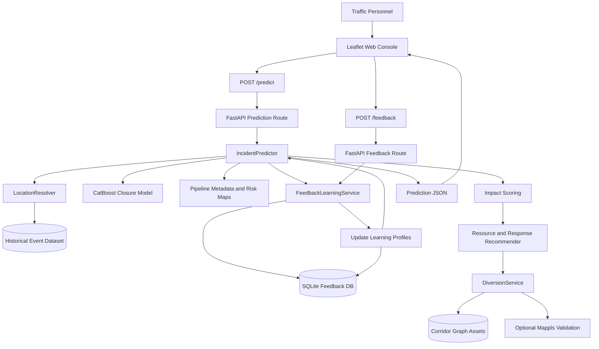

# Incident Response Planner


Event-Driven Congestion (Planned and Unplanned) incident response system built with FastAPI, SQLite, CatBoost, NetworkX/OSMnx graph assets, and Leaflet.

The system forecasts event-related traffic impact and recommends operational actions such as manpower deployment, barricading, response priority, ETA targets, and diversion planning for Bengaluru traffic operations.

## Operational Challenge

Political rallies, festivals, sports events, construction activities, and sudden gatherings can create localized traffic breakdowns.

## Why It Is Hard Today

- Event impact is often not quantified in advance.
- Resource deployment is largely experience-driven.
- Field outcomes are usually not fed back into future planning.
- Diversion planning depends on local corridor knowledge and live judgement.

## Problem Statement Direction

How can historical and real-time data be used to forecast event-related traffic impact and recommend optimal manpower, barricading, and diversion plans?

## What This System Does

- Accepts planned and unplanned incident inputs from traffic personnel.
- Lets operators choose incident latitude/longitude through a Leaflet map.
- Derives corridor, zone, police station, hour, day of week, month, weekend, and peak-hour features automatically.
- Loads the trained closure model and pipeline metadata once, then reuses them for predictions.
- Predicts road closure probability, traffic impact score, and impact class.
- Reports prediction confidence from historical feature support.
- Stabilizes sparse CatBoost outputs with confidence-aware smoothing and sanity rules.
- Recommends officers, barricades, patrol vehicles, ambulance need, and crane need.
- Produces response priority, ETA target, traffic forecast, and diversion strategy.
- Generates corridor-aware diversion route outputs using precomputed graph assets.
- Captures post-event feedback and immediately updates learned calibration profiles.
- Exposes downloadable analytics exports from the React dashboard.
- Renders the heatmap as an actual Leaflet intensity map instead of only a point table.
- Surfaces prediction confidence explicitly in the prediction dashboard.
- Uses two equal-height incident and diversion maps in the prediction workflow for a clearer operator view.

## System Architecture

The application is split into five layers:

1. **Frontend operations console**
   - `backend/app/static/index.html`
   - `backend/app/static/app.js`
   - `backend/app/static/styles.css`
   - Provides the incident input form, Leaflet map click handling, prediction dashboard, diversion route map, and post-event feedback form.

2. **FastAPI route layer**
   - `backend/app/routes/predict.py`
   - `backend/app/routes/feedback.py`
   - Exposes `/predict`, `/options`, `/feedback`, and `/feedback/summary`.

3. **Prediction and recommendation services**
   - `backend/app/services/predictor.py`
   - `backend/app/services/recommender.py`
   - Converts request payloads into model features, runs closure probability inference, applies learned calibration, computes impact score/class, and builds response/resource/forecast recommendations.

4. **Location and routing services**
   - `backend/app/services/utils.py`
   - `backend/app/services/diversion.py`
   - Infers corridor/zone/police station from historical incident locations and uses corridor graph artifacts to find practical diversion routes.

5. **Learning and persistence layer**
   - `backend/app/services/feedback_learning.py`
   - `backend/data/feedback.sqlite3`
   - Stores field feedback and maintains learned outcome profiles by event type, cause, corridor, zone, police station, and global history.

## Architecture Diagram



## Prediction Flow

1. The frontend submits event type, cause, vehicle type, priority, authentication flag, incident coordinates, and incident datetime.
2. The backend derives operational context:
   - `corridor`
   - `zone`
   - `police_station`
   - `hour`
   - `dayofweek`
   - `month`
   - `is_weekend`
   - `is_peak_hour`
3. `IncidentPredictor` runs the trained CatBoost model when available. If the model cannot be loaded, it falls back to metadata risk maps.
4. `FeedbackLearningService` applies learned calibration from real field outcomes.
5. The backend smooths low-confidence probability estimates toward the global historical closure mean.
6. Sanity rules make small corrections for operationally obvious cases such as accident plus heavy vehicle.
7. The backend computes impact score, impact class, resource plan, response priority, ETA target, and traffic forecast.
8. If the incident has enough closure risk, `DiversionService` picks the nearest graph by location and finds a route without depending on the corridor label.
9. The frontend renders the prediction dashboard, confidence notes, routing mode, and diversion route polyline.

The React predict page now also shows the confidence score directly and keeps the incident picker and diversion map in equal-height panels.

## Prediction Confidence and Stabilization

Sparse categories can make ML outputs noisy. The project now computes prediction reliability from training frequency for:

- `event_type`
- `event_cause`
- `veh_type`
- `police_station`
- `corridor`

The `/predict` response includes:

```json
{
  "prediction_confidence": {
    "score": 0.78,
    "label": "High"
  },
  "prediction_notes": [
    "Rare veh_type: example",
    "Using smoothed probability estimate"
  ]
}
```

Low-confidence predictions are smoothed toward the historical global closure mean. A stabilization layer limits large probability jumps from sparse or dominant fields such as `veh_type`, `authenticated`, and `priority`. A small sanity-rule layer then applies conservative operational corrections.

## Dynamic Graph Routing

Routing no longer depends on `incident -> corridor -> graph`. The route planner now uses:

```text
incident location -> nearest graph registry -> route search
```

`backend/app/services/graph_registry.py` builds graph metadata from graph pickle files and selects the nearest graph centers within a threshold radius. `DiversionService` tries the nearest three graph candidates before returning fallback monitoring mode:

```json
{
  "routing_status": "No graph route found, monitoring traffic",
  "diversion_strategy": "Traffic Monitoring Only"
}
```

## Closed-Loop Feedback Learning System

The closed-loop system turns post-event field outcomes into future prediction improvements.

### What Feedback Captures

After an incident is resolved, the operator can submit:

- Whether road closure actually happened.
- Actual observed delay in minutes.
- Optional operational notes.
- The original incident input and prediction snapshot.

This is stored in `backend/data/feedback.sqlite3`.

### How Learning Profiles Work

Each feedback record updates learning profiles across multiple operational dimensions:

- `global`
- `event_type`
- `event_cause`
- `corridor`
- `zone`
- `police_station`

For each profile, the system tracks:

- Number of feedback samples.
- Number of actual closure events.
- Average actual delay.
- Average predicted closure probability.
- Average predicted delay.
- Average impact error.

### How Predictions Improve Over Time

Future predictions start with the base model probability, then apply a bounded calibration adjustment from matching feedback profiles.

For example:

- If accidents on a corridor repeatedly cause closure more often than predicted, the closure probability for similar future incidents increases.
- If a police station area repeatedly has lower actual delay than forecasted, future delay estimates for matching incidents are reduced.
- If there are too few samples, the adjustment stays conservative.

The original model remains the stable baseline. Feedback acts as an online calibration layer, so the app improves immediately without retraining on every request.

### Why This Is Safe Operationally

- Feedback adjustments are capped to avoid sudden overcorrection.
- Profiles need multiple samples before they influence predictions.
- The trained model and metadata fallback remain intact.
- The `/feedback/summary` endpoint makes learned profiles inspectable.
- The architecture supports future offline retraining by exporting the SQLite feedback records.

## Frontend Operational Views

### Predict

- The incident form stays on the left.
- The incident picker map and diversion route map are rendered as two equal-height panels on the right.
- The result band now shows impact score, impact class, closure probability, and confidence score.
- The post-event feedback form is always visible on the predict page so operators can submit outcomes right after a run.

### Analytics

- The dashboard includes export actions for JSON and CSV snapshots.
- It also renders corridor, cause, vehicle, and hourly visuals so the page is not only a static statistics view.
- The React analytics route now redirects to the static analytics dashboard so there is one source of truth for plots and heatmaps.

### Heatmap

- The heatmap page now uses Leaflet circles to visualize intensity directly on a map.
- A point table remains below the map for operator reference.

## API Endpoints

- `POST /predict`: predicts closure probability, impact, resources, response priority, traffic forecast, and diversion plan.
- `POST /feedback`: stores field feedback and updates learning profiles.
- `GET /feedback/summary`: returns current learned profile statistics.
- `GET /options`: returns dropdown values discovered from the historical incident dataset.
- `GET /health`: basic service health check.

## Expected Prediction Response

```json
{
  "impact_score": 43.51,
  "impact_class": "Medium",
  "closure_probability": 0.016,
  "resource_plan": {
    "officers": 4,
    "barricades": 1,
    "patrol_vehicles": 1,
    "ambulance_required": false,
    "crane_required": true
  },
  "traffic_forecast": {
    "severity": "Moderate",
    "expected_delay_mins": 15.4
  },
  "response_priority": "High",
  "eta_target": "15 mins",
  "diversion_strategy": "Traffic Monitoring Only",
  "diversion_plan": {},
  "derived_context": {},
  "model_status": "catboost_model_loaded",
  "learning_insight": {
    "base_closure_probability": 0.016,
    "calibration_adjustment": 0.0,
    "matched_profiles": 0,
    "learning_samples": 0
  }
}
```

## Dataset and Artifacts

- Dataset: `datasets/Astram event data_anonymized - Astram event data_anonymizedb40ac87.csv`
- Closure model: `models/closure_model.pkl`
- Pipeline metadata: `models/pipeline_metadata.pkl`
- Routing graph assets: `graphs/` and/or `models/bangalore.graphml`
- Notebook reference: `Notebook.ipynb`

## Tech Stack

- Backend API: FastAPI
- Model and feature pipeline: pandas, scikit-learn, CatBoost
- Routing and network analysis: NetworkX and OSMnx graph artifacts
- Frontend: HTML, CSS, vanilla JavaScript, Leaflet
- Feedback store: SQLite

## Run

```bash
cd backend
python3 -m venv .venv
source .venv/bin/activate
pip install -r requirements.txt
uvicorn app.main:app --reload --reload-exclude ".venv/*"
```

Open:

```text
http://127.0.0.1:8000
```

## Project Layout

```text
backend/
  app/
    main.py
    schemas.py
    routes/
      predict.py
      feedback.py
    services/
      predictor.py
      recommender.py
      diversion.py
      feedback_learning.py
      utils.py
    static/
      index.html
      app.js
      styles.css
  data/
    feedback.sqlite3
  requirements.txt
datasets/
models/
Notebook.ipynb
```

## Future Retraining Path

The current closed loop performs online calibration. For deeper retraining:

1. Export feedback rows from `backend/data/feedback.sqlite3`.
2. Join them with the original incident feature rows.
3. Recompute target labels from actual closure and delay outcomes.
4. Retrain the CatBoost closure model and update `models/closure_model.pkl`.
5. Regenerate `models/pipeline_metadata.pkl`.
6. Restart FastAPI so the updated artifacts are loaded.

This keeps real-time operations responsive while still supporting periodic model improvement.
